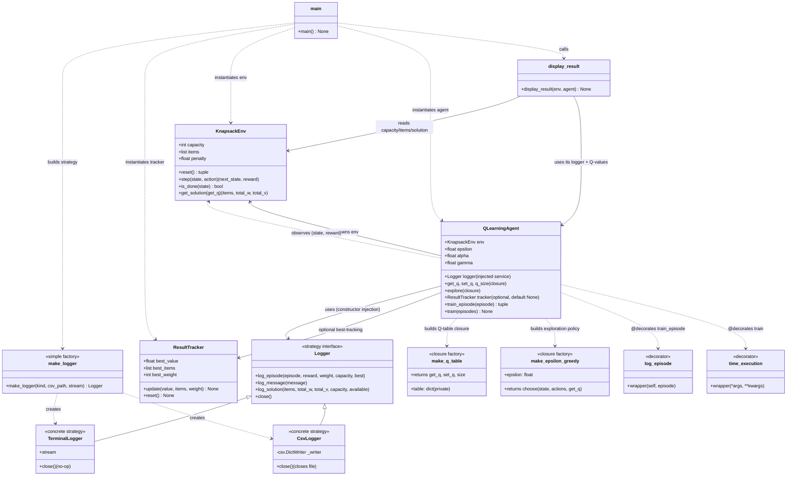

# Structure of `main.py`

Mermaid class diagram showing the structure of the RL Knapsack solver in `Lesson1/main.py` (plus its supporting modules `logger.py` and `result_tracker.py`).

## Key relationships

| Component | Role |
| --- | --- |
| `KnapsackEnv` | Defines the state space, action space, and reward function (0/1 knapsack). |
| `QLearningAgent` | The learner — runs the Q-learning loop with the Bellman equation. Owns a `KnapsackEnv` and receives a `Logger` via constructor injection. |
| `ResultTracker` | Remembers the best (highest-value) solution found during training (`update` / `reset`). |
| `Logger` (interface) | **Strategy contract** — the only interface the agent/main code depends on for output. |
| `TerminalLogger` | **Concrete strategy** — renders structured log events as formatted text on a stream (default stdout). |
| `CsvLogger` | **Concrete strategy** — serializes structured log events into CSV rows via the stdlib `csv.DictWriter` (header + event rows). |
| `make_logger(kind, ...)` | Simple factory returning the right strategy ("terminal" or "csv") from the `--log` CLI flag. |
| `make_q_table()` | Closure returning `get_q`, `set_q`, `size` — encapsulates the Q-table (private dict). |
| `make_epsilon_greedy(epsilon)` | Closure returning `choose` — balances exploration vs exploitation. |
| `log_episode` / `time_execution` | Decorators applied to `QLearningAgent` methods; both delegate output to the agent's `Logger`. |
| `display_result(env, agent)` | Delegates the solution report to the agent's `Logger` strategy. |
| `main()` | Ties everything together: parses `--log`/`--csv-path`, builds `env`, `tracker`, `logger`, `agent`, trains, shows results. |